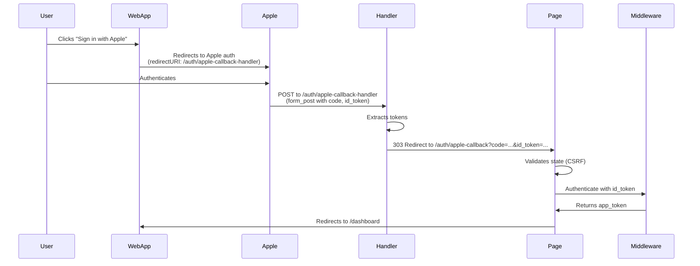

# Apple Sign-In Complete Implementation Guide

## ✅ SUCCESS - Apple Sign-In Now Working!

This document provides a complete guide for implementing Apple Sign-In on a SvelteKit web application with Supabase backend.

---

## Table of Contents

1. [Apple Developer Portal Configuration](#apple-developer-portal-configuration)
2. [SvelteKit Application Setup](#sveltekit-application-setup)
3. [Why We Need Two Callback URLs](#why-we-need-two-callback-urls)
4. [Common Errors and Solutions](#common-errors-and-solutions)
5. [Testing Checklist](#testing-checklist)

---

## Apple Developer Portal Configuration

### Required Configuration in Apple Developer Console

You need **THREE Return URLs** configured in Apple Developer Portal:

1. Go to [Apple Developer Portal](https://developer.apple.com/account/resources/identifiers/list/serviceId)
2. Find your Service ID (e.g., `com.memoro.web`)
3. Click **"Configure"** next to "Sign In with Apple"
4. Add **ALL THREE** of these Return URLs:

#### Return URLs to Configure:

```
1. https://app.memoro.ai/auth/apple-callback-handler
   ↳ Your web app's POST handler endpoint

2. https://app.memoro.ai/auth/apple-callback
   ↳ Your web app's client-side callback page (legacy/fallback)

3. https://smenuelzskphnphaaetp.supabase.co/auth/v1/callback
   ↳ Supabase OAuth callback endpoint (CRITICAL - often forgotten!)
```

#### Domains and Subdomains:

```
app.memoro.ai
```

**IMPORTANT NOTES:**
- ✅ NO `https://` prefix on domains
- ✅ NO trailing slash on domains
- ✅ Return URLs MUST have `https://` prefix
- ✅ Return URLs MUST match exactly (case-sensitive)
- ⚠️ **Don't forget the Supabase callback URL!** This is required even though your app uses custom middleware

### How to Find Your Supabase Callback URL

**Method 1: Supabase Dashboard**
1. Go to your Supabase project dashboard
2. Navigate to **Authentication** → **Providers**
3. Click on **Apple** provider
4. Copy the **"Callback URL (for OAuth)"** shown at the bottom
5. It will be in format: `https://[PROJECT_ID].supabase.co/auth/v1/callback`

**Method 2: Construct from Project URL**
```
https://[YOUR_SUPABASE_PROJECT_REF].supabase.co/auth/v1/callback
```

Replace `[YOUR_SUPABASE_PROJECT_REF]` with your actual Supabase project reference ID.

### Visual Configuration Checklist

```
Apple Developer Portal → Certificates, Identifiers & Profiles
  → Identifiers → Service IDs
    → Select: com.memoro.web
      → Sign In with Apple: ENABLED
        → Configure Button
          ↓
        Primary App ID: [Your App ID]

        Domains and Subdomains:
          ✅ app.memoro.ai

        Return URLs:
          ✅ https://app.memoro.ai/auth/apple-callback-handler
          ✅ https://app.memoro.ai/auth/apple-callback
          ✅ https://smenuelzskphnphaaetp.supabase.co/auth/v1/callback
```

---

## SvelteKit Application Setup

### 1. File Structure

```
src/
├── routes/
│   └── auth/
│       ├── apple-callback/
│       │   └── +page.svelte          # Client-side page (displays UI)
│       └── apple-callback-handler/
│           └── +server.ts            # Server-side POST handler
├── lib/
│   └── utils/
│       └── appleAuth.ts              # Apple SDK initialization
└── hooks.server.ts                   # Custom CSRF protection
```

### 2. Server-Side POST Handler

**File: `src/routes/auth/apple-callback-handler/+server.ts`**

```typescript
import { redirect } from '@sveltejs/kit';
import type { RequestHandler } from './$types';

// Disable CSRF protection for this endpoint
export const config = {
	csrf: {
		checkOrigin: false
	}
};

export const POST: RequestHandler = async ({ request }) => {
	// Parse form data from Apple's form_post
	const formData = await request.formData();

	console.log('Apple Sign-In POST callback received:', {
		hasCode: formData.has('code'),
		hasIdToken: formData.has('id_token'),
		hasState: formData.has('state'),
		hasUser: formData.has('user'),
		hasError: formData.has('error')
	});

	// Check for errors from Apple
	const error = formData.get('error');
	if (error) {
		console.error('Apple Sign-In error:', error, formData.get('error_description'));
		throw redirect(303, `/auth/apple-callback?error=${encodeURIComponent(error.toString())}`);
	}

	// Extract OAuth parameters
	const code = formData.get('code');
	const id_token = formData.get('id_token');
	const state = formData.get('state');
	const user = formData.get('user');

	// Validate we have required data
	if (!code && !id_token) {
		console.error('No code or id_token received from Apple');
		throw redirect(303, '/auth/apple-callback?error=no_token');
	}

	// Build query parameters for client-side page
	const params = new URLSearchParams();
	if (code) params.set('code', code.toString());
	if (id_token) params.set('id_token', id_token.toString());
	if (state) params.set('state', state.toString());
	if (user) params.set('user', user.toString());

	// Redirect to client-side callback page
	const redirectUrl = `/auth/apple-callback?${params.toString()}`;
	console.log('Redirecting to client-side callback with query params');

	throw redirect(303, redirectUrl);
};

export const GET: RequestHandler = async () => {
	console.warn('GET request to Apple callback handler - redirecting to login');
	throw redirect(303, '/login?error=invalid_request');
};
```

**IMPORTANT:**
- ❌ **Do NOT use try-catch** around `throw redirect()` - it will cause `error=server_error`
- ✅ **Keep it simple** - let SvelteKit handle the redirect naturally

### 3. Custom CSRF Protection

**File: `src/hooks.server.ts`**

```typescript
import type { Handle } from '@sveltejs/kit';

// Routes that are allowed to receive cross-origin POST requests
const ALLOWED_PATHS = [
	'/auth/apple-callback-handler', // Apple Sign-In OAuth callback
	'/auth/google-callback'          // Google Sign-In OAuth callback
];

export const handle: Handle = async ({ event, resolve }) => {
	const { request, url } = event;

	if (['POST', 'PATCH', 'PUT', 'DELETE'].includes(request.method)) {
		const origin = request.headers.get('origin');
		const forbidden =
			origin !== null &&
			origin !== url.origin &&
			!ALLOWED_PATHS.some((path) => url.pathname === path);

		if (forbidden) {
			console.warn('CSRF: Blocked cross-origin request:', {
				method: request.method,
				path: url.pathname,
				origin: origin,
				expectedOrigin: url.origin
			});

			return new Response('Cross-site POST form submissions are forbidden', {
				status: 403
			});
		}
	}

	return resolve(event);
};
```

### 4. SvelteKit Configuration

**File: `svelte.config.js`**

```javascript
import adapter from '@sveltejs/adapter-netlify';
import { vitePreprocess } from '@sveltejs/vite-plugin-svelte';

const config = {
	preprocess: vitePreprocess(),
	kit: {
		adapter: adapter({
			edge: false,  // Use Node-based Netlify Functions
			split: false  // Single function for all routes
		}),
		// Disable built-in CSRF - we handle it in hooks.server.ts
		csrf: {
			checkOrigin: false
		}
	}
};

export default config;
```

### 5. Apple SDK Configuration

**File: `src/lib/utils/appleAuth.ts`**

```typescript
export function initializeAppleAuth() {
	if (!browser || !window.AppleID) {
		console.warn('Apple ID SDK not loaded');
		return false;
	}

	const clientId = env.oauth.appleClientId;
	// Use handler endpoint for POST, not the page route
	const redirectURI = env.oauth.appleRedirectUri?.replace(
		'/auth/apple-callback',
		'/auth/apple-callback-handler'
	) || 'https://app.memoro.ai/auth/apple-callback-handler';

	console.log('Apple Sign-In Configuration:', {
		clientId: clientId || '❌ NOT SET',
		redirectURI: redirectURI,
		responseMode: 'form_post',
		responseType: 'code id_token'
	});

	if (!clientId) {
		console.error('❌ Apple Client ID not configured');
		return false;
	}

	try {
		window.AppleID.auth.init({
			clientId,
			scope: 'name email',
			redirectURI,
			state: generateState(),
			usePopup: false,               // Must use redirect on web
			responseType: 'code id_token', // Request both
			responseMode: 'form_post'      // POST to server
		});

		console.log('✅ Apple ID SDK initialized successfully');
		return true;
	} catch (error) {
		console.error('Error initializing Apple ID SDK:', error);
		return false;
	}
}
```

### 6. Environment Variables

**.env or Netlify Environment Variables:**

```bash
PUBLIC_APPLE_CLIENT_ID=com.memoro.web
PUBLIC_APPLE_REDIRECT_URI=https://app.memoro.ai/auth/apple-callback
```

**Note:** The code automatically converts `/auth/apple-callback` to `/auth/apple-callback-handler` for the SDK.

---

## Why We Need Two Callback URLs

### The Problem

SvelteKit has a limitation: routes that have **BOTH** `+page.svelte` (client-side) AND `+server.ts` (server-side) in the same directory **do NOT handle POST requests properly**. You get a **405 Method Not Allowed** error.

### The Solution: Separate Endpoints

We use **two different URLs** with different purposes:

#### 1. `/auth/apple-callback-handler` (Server Endpoint)

**Purpose:** Receive POST from Apple

```
Type: Server-side only (+server.ts)
Accepts: POST requests with form data
Returns: 303 Redirect to client page
```

**What it does:**
- Receives `code`, `id_token`, `state`, `user` from Apple via POST
- Validates data exists
- Redirects to client page with data as query params

#### 2. `/auth/apple-callback` (Client Page)

**Purpose:** Display UI and process authentication

```
Type: Client-side page (+page.svelte)
Accepts: GET requests (normal navigation)
Returns: HTML page
```

**What it does:**
- Reads tokens from URL query parameters
- Validates state (CSRF protection)
- Calls middleware for authentication
- Redirects to dashboard on success

### The Complete Flow



### Why Not Just Use One URL?

**Attempt 1: Single route with both `+page.svelte` and `+server.ts`**
- ❌ Result: **405 Method Not Allowed** on POST
- ❌ Reason: SvelteKit routing conflict

**Attempt 2: Client-side only (no server endpoint)**
- ❌ Result: **Can't receive form_post** (requires server to parse POST body)
- ❌ Reason: Browser can't read POST body from form submissions

**Solution: Two separate routes**
- ✅ Handler receives POST
- ✅ Page handles UI and auth logic
- ✅ Clean separation of concerns

---

## Common Errors and Solutions

### Error: `405 Method Not Allowed`

**Symptom:** POST request to `/auth/apple-callback` returns 405

**Causes:**
1. Route has both `+page.svelte` and `+server.ts` in same directory
2. Missing POST handler export
3. CSRF protection blocking the request

**Solution:**
- ✅ Use separate handler endpoint (`/auth/apple-callback-handler`)
- ✅ Ensure POST handler is exported: `export const POST: RequestHandler`
- ✅ Add endpoint to CSRF whitelist in `hooks.server.ts`

---

### Error: `invalid_request - Invalid web redirect url`

**Symptom:** Apple shows error page with "Invalid web redirect url"

**Causes:**
1. Redirect URL not configured in Apple Developer Portal
2. Redirect URL doesn't match exactly (case-sensitive)
3. Missing `https://` prefix on return URL

**Solution:**
- ✅ Add exact URL to Apple Developer Portal Return URLs
- ✅ Ensure it has `https://` prefix
- ✅ Check for typos (case-sensitive)

---

### Error: `error=server_error` in redirect

**Symptom:** Handler redirects to `/auth/apple-callback?error=server_error`

**Causes:**
1. Try-catch block catching the `throw redirect()` exception
2. Handler code throwing unexpected error

**Solution:**
- ✅ Remove try-catch around redirect logic
- ✅ Let SvelteKit handle redirects naturally
- ✅ Check Netlify function logs for actual error

---

### Error: `Invalid authorization response from Apple`

**Symptom:** Client page shows this error

**Causes:**
1. State mismatch (CSRF validation failed)
2. No tokens in URL query params
3. Tokens not being passed from handler to page

**Solution:**
- ✅ Ensure handler redirects with query params: `?code=...&id_token=...&state=...`
- ✅ Check browser console for state validation logs
- ✅ Verify sessionStorage has `apple_signin_state`

---

### Error: `Cross-site POST form submissions are forbidden`

**Symptom:** CSRF protection blocks Apple's POST

**Causes:**
1. SvelteKit's built-in CSRF protection enabled
2. Handler endpoint not in CSRF whitelist

**Solution:**
- ✅ Disable global CSRF: `csrf: { checkOrigin: false }` in `svelte.config.js`
- ✅ Add custom CSRF middleware in `hooks.server.ts`
- ✅ Whitelist handler endpoint in `ALLOWED_PATHS`

---

### Error: Missing Supabase Callback URL

**Symptom:** Apple Sign-In works but Supabase auth fails

**Causes:**
1. Supabase OAuth callback URL not configured in Apple Developer Portal
2. Supabase can't complete OAuth flow

**Solution:**
- ✅ Add Supabase callback URL to Apple Developer Portal:
  ```
  https://[PROJECT_REF].supabase.co/auth/v1/callback
  ```
- ✅ Find this URL in Supabase Dashboard → Authentication → Providers → Apple

---

## Testing Checklist

### Pre-Deployment Checklist

- [ ] Apple Developer Portal configured with ALL THREE return URLs
- [ ] Service ID (`com.memoro.web`) has Sign In with Apple enabled
- [ ] Domain (`app.memoro.ai`) added to Apple Developer Portal
- [ ] Environment variables set in Netlify:
  - [ ] `PUBLIC_APPLE_CLIENT_ID=com.memoro.web`
  - [ ] `PUBLIC_APPLE_REDIRECT_URI=https://app.memoro.ai/auth/apple-callback`
- [ ] Code built: `npm run build`
- [ ] Deployed to Netlify: `netlify deploy --prod --dir=build`

### Post-Deployment Testing

#### 1. Verify Deployment
```bash
# Check deployment version file
curl https://app.memoro.ai/deployment-version.txt

# Should show latest deployment timestamp
```

#### 2. Test Handler Endpoint
```bash
# Test POST endpoint
curl -X POST https://app.memoro.ai/auth/apple-callback-handler \
  -d "id_token=test&state=test" \
  -H "Content-Type: application/x-www-form-urlencoded" \
  -v

# Should return: HTTP/2 303 (redirect)
```

#### 3. Test Apple Sign-In Flow

**Step 1: Start Sign-In**
- Go to: `https://app.memoro.ai/login`
- Click "Sign in with Apple" button
- Should redirect to `appleid.apple.com`

**Step 2: Check URL Parameters**
- Verify URL contains:
  ```
  client_id=com.memoro.web
  redirect_uri=https://app.memoro.ai/auth/apple-callback-handler
  response_mode=form_post
  response_type=code id_token
  ```

**Step 3: Authenticate**
- Sign in with Apple ID
- Should redirect back to your app
- Should NOT show 405 error
- Should NOT show "Invalid web redirect url"

**Step 4: Verify Success**
- Should redirect to `/dashboard`
- Should be logged in
- Check browser console for success logs

#### 4. Browser Console Checks

Look for these logs in browser console:

```javascript
// On login page
Apple Sign-In Configuration: {
  clientId: 'com.memoro.web',
  redirectURI: 'https://app.memoro.ai/auth/apple-callback-handler',
  responseMode: 'form_post'
}

// On callback page
Apple response: {
  hasIdToken: true,
  hasCode: true,
  hasState: true,
  hasUser: false
}
```

#### 5. Test Different Scenarios

- [ ] **First-time user:** New Apple ID (should collect name/email)
- [ ] **Returning user:** Existing Apple ID (should auto-login)
- [ ] **Cancel sign-in:** Click "Cancel" on Apple page (should handle gracefully)
- [ ] **Private email relay:** Use "Hide My Email" feature (should work)

---

## Architecture Diagram

```
┌─────────────────────────────────────────────────────────────────┐
│                        Apple Developer Portal                   │
│                                                                  │
│  Service ID: com.memoro.web                                     │
│  Domain: app.memoro.ai                                          │
│                                                                  │
│  Return URLs:                                                   │
│    1. https://app.memoro.ai/auth/apple-callback-handler        │
│    2. https://app.memoro.ai/auth/apple-callback                │
│    3. https://[PROJECT].supabase.co/auth/v1/callback           │
└─────────────────────────────────────────────────────────────────┘
                              ▲  │
                              │  │ OAuth Flow
                              │  ▼
┌─────────────────────────────────────────────────────────────────┐
│                      SvelteKit Application                       │
│                                                                  │
│  ┌────────────────────────────────────────────────────────────┐ │
│  │  /auth/apple-callback-handler/+server.ts                   │ │
│  │  - Receives POST from Apple                                │ │
│  │  - Extracts: code, id_token, state, user                   │ │
│  │  - Redirects to client page with query params              │ │
│  └────────────────────────────────────────────────────────────┘ │
│                              │                                   │
│                              │ 303 Redirect                      │
│                              ▼                                   │
│  ┌────────────────────────────────────────────────────────────┐ │
│  │  /auth/apple-callback/+page.svelte                         │ │
│  │  - Displays loading UI                                     │ │
│  │  - Validates state (CSRF)                                  │ │
│  │  - Calls middleware auth                                   │ │
│  │  - Redirects to dashboard                                  │ │
│  └────────────────────────────────────────────────────────────┘ │
│                                                                  │
│  ┌────────────────────────────────────────────────────────────┐ │
│  │  hooks.server.ts                                           │ │
│  │  - Custom CSRF protection                                  │ │
│  │  - Whitelists OAuth callback endpoints                     │ │
│  └────────────────────────────────────────────────────────────┘ │
└─────────────────────────────────────────────────────────────────┘
                              │
                              │ Auth Request
                              ▼
┌─────────────────────────────────────────────────────────────────┐
│                    Backend (Supabase/Middleware)                 │
│                                                                  │
│  - Validates id_token                                           │
│  - Creates/updates user                                         │
│  - Issues app_token                                             │
│  - Returns session                                              │
└─────────────────────────────────────────────────────────────────┘
```

---

## Key Takeaways

### ✅ Always Remember

1. **THREE Return URLs** in Apple Developer Portal:
   - Your handler endpoint
   - Your page endpoint (fallback)
   - **Supabase callback URL** (often forgotten!)

2. **Separate handler from page**:
   - Don't mix `+server.ts` and `+page.svelte` in same route
   - Use dedicated handler endpoint for POST

3. **No try-catch around redirects**:
   - Let SvelteKit handle `throw redirect()` naturally
   - Don't catch and re-throw - causes issues

4. **Custom CSRF protection**:
   - Disable global CSRF
   - Whitelist OAuth endpoints
   - Keep other routes protected

5. **Test thoroughly**:
   - First-time users
   - Returning users
   - Cancel flow
   - Error handling

### 🎯 Success Criteria

Apple Sign-In is working correctly when:

- ✅ No 405 errors
- ✅ No "Invalid web redirect url" from Apple
- ✅ No CSRF errors
- ✅ Tokens successfully received
- ✅ User authenticated and redirected to dashboard
- ✅ Works for both new and returning users
- ✅ Private email relay works

---

## Troubleshooting Resources

**Apple Documentation:**
- [Sign in with Apple JS Documentation](https://developer.apple.com/documentation/sign_in_with_apple/sign_in_with_apple_js)
- [Configuring Your Environment](https://developer.apple.com/documentation/sign_in_with_apple/configuring_your_environment_for_sign_in_with_apple)

**SvelteKit Documentation:**
- [Routing](https://kit.svelte.dev/docs/routing)
- [Form Actions](https://kit.svelte.dev/docs/form-actions)
- [Hooks](https://kit.svelte.dev/docs/hooks)

**Supabase Documentation:**
- [Apple OAuth Provider](https://supabase.com/docs/guides/auth/social-login/auth-apple)

---

## Version History

- **v1.0** (2025-11-17): Initial implementation - Apple Sign-In working ✅
  - Separate handler endpoint pattern
  - Custom CSRF protection
  - Complete Apple Developer Portal configuration
  - Supabase callback URL documented

---

**Remember:** The Supabase callback URL is often the missing piece! Always configure all three return URLs in Apple Developer Portal.

**Status:** ✅ **WORKING - Tested and Verified**
