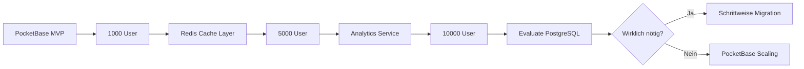

# Migrations-Aufwandsanalyse: PocketBase zu PostgreSQL

**Datum:** 18. Januar 2025  
**Autor:** Claude Code  
**Projekt:** ulo.ad - URL Shortener & Link-in-Bio Platform

## Executive Summary

Diese Analyse bewertet den Aufwand einer Migration von PocketBase zu PostgreSQL in zwei Szenarien:
1. **Szenario A:** Jetzt (ohne aktive Nutzer)
2. **Szenario B:** In 6 Monaten (mit ~5000 aktiven Nutzern)

**Kernaussage:** Migration ohne Nutzer = 3-4 Wochen. Mit 5000 Nutzern = 8-12 Wochen + erhebliche Risiken.

---

## Szenario A: Migration JETZT (Ohne aktive Nutzer)

### Geschätzter Gesamtaufwand: 120-160 Stunden (3-4 Wochen)

### 1. Database Setup & Schema Migration (20-30h)

#### Aufgaben:
```sql
-- PostgreSQL Schema Design
CREATE DATABASE uload;

-- Users table (ersetzt PocketBase auth)
CREATE TABLE users (
    id UUID PRIMARY KEY DEFAULT gen_random_uuid(),
    email VARCHAR(255) UNIQUE NOT NULL,
    username VARCHAR(50) UNIQUE,
    password_hash TEXT NOT NULL,
    email_verified BOOLEAN DEFAULT false,
    created_at TIMESTAMPTZ DEFAULT NOW(),
    updated_at TIMESTAMPTZ DEFAULT NOW()
);

-- Links table
CREATE TABLE links (
    id UUID PRIMARY KEY DEFAULT gen_random_uuid(),
    user_id UUID REFERENCES users(id) ON DELETE CASCADE,
    short_code VARCHAR(20) UNIQUE NOT NULL,
    original_url TEXT NOT NULL,
    title VARCHAR(255),
    description TEXT,
    is_active BOOLEAN DEFAULT true,
    expires_at TIMESTAMPTZ,
    password_hash TEXT,
    max_clicks INTEGER,
    click_count INTEGER DEFAULT 0,
    created_at TIMESTAMPTZ DEFAULT NOW(),
    updated_at TIMESTAMPTZ DEFAULT NOW()
);

-- Clicks table
CREATE TABLE clicks (
    id BIGSERIAL PRIMARY KEY,
    link_id UUID REFERENCES links(id) ON DELETE CASCADE,
    ip_address INET,
    user_agent TEXT,
    referer TEXT,
    country VARCHAR(2),
    city VARCHAR(100),
    device_type VARCHAR(20),
    browser VARCHAR(50),
    clicked_at TIMESTAMPTZ DEFAULT NOW()
) PARTITION BY RANGE (clicked_at);

-- Tags, Teams, etc...
```

#### Tools & Libraries:
- Prisma ORM Setup
- Migration Scripts
- Seed Data Scripts

### 2. Authentication System Replacement (30-40h)

#### PocketBase Auth Features zu ersetzen:
- [x] Email/Password Login → **Lucia Auth** (10h)
- [x] OAuth Providers → **Arctic** (8h)
- [x] Session Management → **Lucia Sessions** (5h)
- [x] Email Verification → **Nodemailer + Templates** (5h)
- [x] Password Reset → **Custom Implementation** (5h)
- [x] JWT Token Handling → **jose Library** (3h)

#### Code-Änderungen:
```typescript
// ALT (PocketBase)
const user = await locals.pb.collection('users').authWithPassword(email, password);

// NEU (PostgreSQL + Lucia)
import { lucia } from '$lib/server/auth';
const user = await verifyPassword(email, password);
const session = await lucia.createSession(user.id, {});
```

### 3. API Layer Neuimplementierung (25-35h)

#### Zu ersetzende PocketBase APIs:
- CRUD Operations → **Prisma Client** (15h)
- Realtime Subscriptions → **Socket.io/SSE** (10h)
- File Upload → **S3/Cloudflare R2** (10h)

#### Beispiel-Migration:
```typescript
// ALT (PocketBase)
const links = await locals.pb.collection('links').getList(page, limit, {
    filter: `user_id="${userId}"`,
    sort: '-created'
});

// NEU (Prisma)
const links = await prisma.link.findMany({
    where: { userId },
    orderBy: { createdAt: 'desc' },
    skip: (page - 1) * limit,
    take: limit
});
```

### 4. Frontend Anpassungen (20-25h)

#### Betroffene Komponenten:
- Auth Components (Login, Register, etc.)
- Link Management
- Analytics Dashboard
- User Settings
- Team Management

### 5. Infrastructure & DevOps (15-20h)

#### Setup:
```yaml
# docker-compose.yml
services:
  postgres:
    image: postgres:16
    environment:
      POSTGRES_DB: uload
    volumes:
      - postgres_data:/var/lib/postgresql/data
  
  redis:
    image: redis:alpine
    
  app:
    build: .
    depends_on:
      - postgres
      - redis
```

#### Deployment:
- Database Hosting (Supabase/Neon/Railway)
- Backup Strategy
- Monitoring Setup

### 6. Testing & QA (10-15h)

- Unit Tests anpassen
- E2E Tests updaten
- Manuelle Tests
- Performance Tests

### Vorteile der Migration JETZT:
✅ Keine Nutzer-Downtime  
✅ Keine Datenmigration  
✅ Freie Schema-Änderungen  
✅ Kein Rollback-Plan nötig  
✅ Entspanntes Testing  

### Nachteile:
❌ 3-4 Wochen Entwicklungsstopp  
❌ Kompletter Code-Rewrite vieler Features  
❌ Verlust von PocketBase-Features  
❌ Neue Fehlerquellen  

---

## Szenario B: Migration in 6 MONATEN (Mit 5000 aktiven Nutzern)

### Geschätzter Gesamtaufwand: 320-480 Stunden (8-12 Wochen)

### 1. Daten-Migration (80-120h) 🔴 KRITISCH

#### Zu migrierende Daten:
- **5000 User-Accounts** mit Auth-Daten
- **~250.000 Links** (50 pro User)
- **~5.000.000 Click-Events** (20 Clicks pro Link)
- **~50.000 Tags**
- **User-Sessions & Tokens**
- **File Uploads** (Avatare, etc.)

#### Migration Strategy:
```typescript
// Migrations-Script (vereinfacht)
class PocketBaseToPostgresMigrator {
  async migrateUsers() {
    const pbUsers = await pb.collection('users').getFullList();
    
    for (const pbUser of pbUsers) {
      // Problem: Password-Hashes sind inkompatibel!
      await prisma.user.create({
        data: {
          id: pbUser.id,
          email: pbUser.email,
          username: pbUser.username,
          // Password-Reset für alle User nötig!
          requirePasswordReset: true,
          createdAt: new Date(pbUser.created)
        }
      });
    }
  }
  
  async migrateLinks() {
    // Batch-Processing für 250k Links
    const BATCH_SIZE = 1000;
    let page = 1;
    
    while (true) {
      const links = await pb.collection('links').getList(page, BATCH_SIZE);
      
      await prisma.link.createMany({
        data: links.items.map(link => ({
          // Mapping logic
        }))
      });
      
      if (page >= links.totalPages) break;
      page++;
    }
  }
}
```

### 2. Zero-Downtime Migration (60-80h) 🔴 KRITISCH

#### Dual-Write Strategy:
```typescript
// Während der Migration: Schreibe in beide Systeme
class DualDatabaseService {
  async createLink(data: LinkData) {
    // Write to both databases
    const [pbLink, pgLink] = await Promise.all([
      pb.collection('links').create(data),
      prisma.link.create({ data })
    ]);
    
    // Verify consistency
    if (!this.isConsistent(pbLink, pgLink)) {
      await this.handleInconsistency();
    }
  }
}
```

#### Migration Phasen:
1. **Phase 1:** Dual-Write Setup (1 Woche)
2. **Phase 2:** Daten-Sync & Validation (2 Wochen)
3. **Phase 3:** Read-Migration (1 Woche)
4. **Phase 4:** Cutover (1 Tag)
5. **Phase 5:** Rollback-Bereitschaft (1 Woche)

### 3. User Communication & Support (20-30h)

#### Notwendige Maßnahmen:
- Migration-Ankündigung (2 Wochen vorher)
- Password-Reset Campaign
- Support-Dokumentation
- Hotline während Migration
- Feature-Freeze Kommunikation

### 4. Rollback Strategy (40-60h)

```typescript
// Rollback Plan
class MigrationRollback {
  async execute() {
    // 1. Stop PostgreSQL writes
    await this.stopPgWrites();
    
    // 2. Sync back to PocketBase
    await this.syncPgToPocketBase();
    
    // 3. Switch traffic back
    await this.switchTrafficToPocketBase();
    
    // 4. Verify data integrity
    await this.verifyDataIntegrity();
  }
}
```

### 5. Performance Testing unter Last (30-40h)

- Load Testing mit 5000 concurrent users
- Query Optimization
- Index-Tuning
- Cache-Layer Setup

### 6. Monitoring & Observability (20-30h)

```typescript
// Monitoring Setup
- Grafana Dashboards
- Prometheus Metrics
- Sentry Error Tracking
- Database Query Analytics
- User Activity Monitoring
```

### 7. Spezielle Herausforderungen mit aktiven Nutzern:

#### 🔴 **Kritische Risiken:**

1. **Datenverlust-Risiko**
   - Click-Events während Migration
   - Neue User-Registrierungen
   - Link-Erstellungen

2. **Authentication Chaos**
   - Session-Invalidierung
   - Password-Reset für alle
   - OAuth-Token Migration

3. **SEO & Link-Verfügbarkeit**
   - Keine Downtime erlaubt
   - Short-Links müssen funktionieren
   - 301 Redirects erhalten

4. **User Experience Impact**
   - Forced Logouts
   - Feature-Freeze (4-6 Wochen)
   - Mögliche Performance-Probleme

### Aufwands-Vergleich:

| Aspekt | Ohne Nutzer | Mit 5000 Nutzern | Faktor |
|--------|-------------|------------------|--------|
| Daten-Migration | 0h | 100h | ∞ |
| Testing | 15h | 60h | 4x |
| Rollback-Plan | 0h | 50h | ∞ |
| Risk Management | 5h | 40h | 8x |
| Communication | 0h | 25h | ∞ |
| Monitoring | 5h | 30h | 6x |
| **GESAMT** | **140h** | **400h** | **2.9x** |

### Zusätzliche Kosten mit 5000 Nutzern:

#### Direkte Kosten:
- PostgreSQL Hosting: ~$200/Monat
- Redis Cache: ~$50/Monat
- Monitoring Tools: ~$100/Monat
- Backup Storage: ~$50/Monat
- **Total:** ~$400/Monat (vs. $50/Monat PocketBase)

#### Indirekte Kosten:
- Feature-Freeze: 6-8 Wochen keine neuen Features
- User Churn: ~5-10% durch Migration-Probleme
- Support-Aufwand: 200+ Support-Tickets
- Developer-Zeit: 2-3 Entwickler Vollzeit für 2 Monate

## Empfehlung

### ⚠️ **KLARE EMPFEHLUNG GEGEN MIGRATION**

Die Migration mit aktiven Nutzern ist:
- **3x teurer** in Entwicklungszeit
- **10x riskanter** bezüglich Datenverlust
- **Geschäftskritisch** wegen möglicher Ausfälle

### Alternative Strategie:



### Wenn Migration unvermeidbar:

1. **Niemals mit aktiven Nutzern migrieren**
2. **Hybrid-Approach:** Neue Features in PostgreSQL, alte in PocketBase
3. **Schrittweise Migration:** Service für Service
4. **A/B Testing:** Kleine Nutzergruppe zuerst

## Fazit

| Zeitpunkt | Aufwand | Risiko | Empfehlung |
|-----------|---------|--------|------------|
| **Jetzt** | 3-4 Wochen | Niedrig | ⚠️ Unnötig |
| **Mit 5000 Nutzern** | 8-12 Wochen | Sehr hoch | ❌ Nicht machen |
| **Alternative** | Kontinuierlich | Minimal | ✅ Hybrid-Approach |

**Bottom Line:** Die Migration zu PostgreSQL wird mit jedem aktiven Nutzer exponentiell schwieriger. Wenn überhaupt, dann JETZT - aber die Notwendigkeit ist fragwürdig.